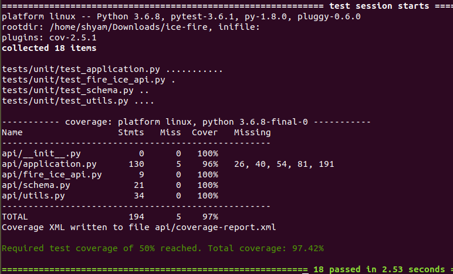

# Demo Books API
***


### Installation

Follow the steps mentioned below to setup the application in you local envirnment. It is assumed that a Ubuntu OS is used. First clone the repository into your local environment. 
```sh
$ git clone -b master https://github.com/Shyam1089/demo-books-api.git
```
Once cloned you need to change your working directory to the cloned repo directory
```sh
$ cd demo-books-api
```
Then the first step is to install the dependency packages, which can be installed using the following command:
```sh
$ pip3 install -r requirements.pip
```
Once the dependency packages are installed you can start the application by running the command:
```sh
$ python3 run_application.py
```
The app will be running locally on port 8080, and the enpoints can be accessed then.

To find the test coverage of the application, run the following command:
```sh
$ python3 -m pytest --cov=api --tb=short --cov-report=term-missing --cov-report=xml:api/coverage-report.xml  --cov-fail-under=50  tests/unit
```

